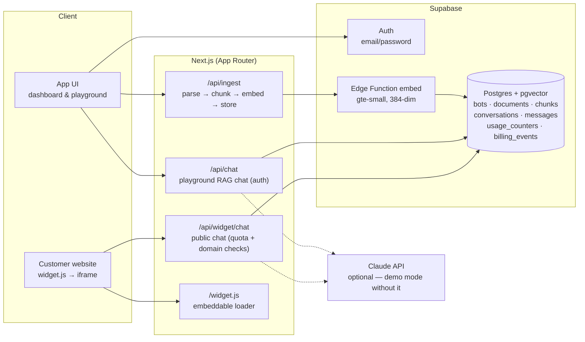

# AskBase — turn your docs into an embeddable AI chatbot

[](https://github.com/devAsmodeus/askbase/actions/workflows/ci.yml)
[](LICENSE)
[](https://nextjs.org)
[](https://supabase.com)

AskBase is a SaaS MVP: upload your company docs and knowledge, get a ChatGPT-style
chatbot inside the app, and embed the same bot on any website with **one line of code**.
Answers are generated with RAG strictly from your content, with source documents cited
on every reply.

**Live demo flow:** landing page → sign up → create a bot → upload docs → test in the
playground → copy the embed snippet → chat bubble on your site. The chat bubble on the
landing page itself is the widget, eating its own dog food.

## Features

- **Knowledge ingestion** — upload PDF / Markdown / TXT / CSV / JSON / HTML or paste
  text. Documents are chunked (paragraph-aware, with overlap) and embedded with
  `gte-small` (384-dim) running inside a Supabase Edge Function — no external
  embedding API needed.
- **RAG chat** — questions are embedded, matched against the bot's chunks via
  `pgvector` (HNSW, cosine), and answered by Claude over the retrieved passages only.
  Every answer lists its source documents. If no `ANTHROPIC_API_KEY` is set, the app
  runs in **demo mode**: the bot answers with the most relevant passages verbatim, so
  the whole product is testable without any AI key.
- **ChatGPT-style playground** — streaming answers, Markdown rendering, conversation
  history, typing indicator. Playground messages don't count against the quota.
- **Embeddable widget** — `<script src=".../widget.js" data-bot-id="..." async>` renders
  a floating chat bubble that opens the bot in an iframe. The launcher picks up the
  bot's accent color automatically. Widget conversations are logged.
- **Domain allowlist** — lock a bot to specific websites so nobody else can embed it
  and burn your quota.
- **Pricing & billing** — Free / Pro $29 / Business $99 with a full (simulated)
  checkout flow, billing history, monthly message quotas, per-plan document and bot
  limits, and "Powered by AskBase" badge removal on paid plans. Limits are enforced
  **in the database** (triggers + quota RPC), not just in the UI.
- **Multi-tenant security** — Postgres RLS on every table; the public widget surface
  is a small set of `security definer` RPCs keyed by an unguessable bot `public_id`.

## Stack

| Layer | Choice |
|---|---|
| App | Next.js 16 (App Router, Turbopack), React 19, TypeScript |
| UI | Tailwind CSS 4, shadcn/ui, lucide-react, sonner |
| Data & auth | Supabase (Postgres + pgvector, RLS, email/password auth) |
| Embeddings | Supabase Edge Function running `gte-small` (free, no API key) |
| LLM | Claude (`claude-haiku-4-5` by default) via `@anthropic-ai/sdk`, optional |
| PDF parsing | `unpdf` |
| Billing | Simulated checkout (per task: "use stripe test account or just mock billing") |

## Architecture



Chat responses stream as plain text with a one-line JSON meta prefix
(`{sources, mode, conversationId}`), consumed by a shared `ChatPanel` component used by
both the playground and the widget iframe.

## Run it locally

### 1. Clone & install

```bash
git clone https://github.com/devAsmodeus/askbase.git
cd askbase
npm install
```

### 2. Supabase

Create a free project at [supabase.com](https://supabase.com), then:

1. Apply the SQL migrations from [`supabase/migrations/`](supabase/migrations) in order
   (SQL Editor → paste & run, or `supabase db push` with the CLI).
2. Deploy the embeddings function from
   [`supabase/functions/embed/index.ts`](supabase/functions/embed/index.ts):
   `supabase functions deploy embed` (keep "Verify JWT" enabled).

### 3. Environment

```bash
cp .env.example .env.local
```

| Variable | Required | Where to get it |
|---|---|---|
| `NEXT_PUBLIC_SUPABASE_URL` | yes | Supabase → Project Settings → API |
| `NEXT_PUBLIC_SUPABASE_ANON_KEY` | yes | same page (anon/publishable key) |
| `ANTHROPIC_API_KEY` | no | [console.anthropic.com](https://console.anthropic.com) — enables full AI answers; without it the bot runs in demo mode (verbatim passages) |
| `NEXT_PUBLIC_APP_URL` | yes | `http://localhost:3000` for local dev |
| `NEXT_PUBLIC_DEMO_BOT_ID` | no | a bot's public id — shows that bot as the live widget on the landing page |

### 4. Start

```bash
npm run dev
```

Open http://localhost:3000.

> **Behind a corporate proxy?** If server-side requests to Supabase fail with
> `fetch failed … self-signed certificate in certificate chain`, your network
> intercepts TLS. Start the dev server with the system certificate store
> (Node ≥ 22.15; the flag is not accepted via `NODE_OPTIONS`):
>
> ```bash
> node --use-system-ca node_modules/next/dist/bin/next dev
> ```

## Product walkthrough (written tutorial)

1. **Landing** (`/`) — features, how-it-works, pricing. The chat bubble in the corner
   is the real widget pointed at a demo bot.
2. **Sign up** (`/login`) — email + password, no confirmation email needed in the MVP
   (auto-confirm trigger; swap for real email confirmation before production).
3. **Create a bot** — "New chatbot" → name it. Free plan allows 1 bot; the limit is
   enforced by a DB trigger, and the UI turns the button into an "Upgrade" link.
4. **Add knowledge** (Knowledge tab) — upload a PDF/MD/TXT file or paste text. Watch
   the document go `processing → ready` with a chunk count. Errors (empty PDFs,
   oversized files) surface on the document row.
5. **Test it** (Playground tab) — ask questions from your docs. Answers stream in with
   source chips underneath. This is the internal ChatGPT-like interface.
6. **Embed it** (Embed tab) — copy the one-line snippet, paste it into any HTML page
   before `</body>`. A chat bubble appears bottom-right; visitors' chats hit your
   monthly message quota and are logged as conversations.
7. **Customize** (Settings tab) — welcome message, accent color (widget + launcher
   tint follow it), custom answer instructions, allowed domains, delete bot.
8. **Upgrade** (Plan & Billing) — usage meters for messages and bots, three plan
   cards, and a demo checkout (prefilled `4242 4242 4242 4242` test card, nothing is
   charged). After "paying", limits raise instantly and the "Powered by AskBase" badge
   disappears from the widget. Billing history records every plan change.

## Design decisions & scope

- **Demo mode over broken chat** — the product stays fully clickable with zero paid
  API keys: retrieval works (embeddings are free via the edge function), and the bot
  transparently labels demo answers. Adding `ANTHROPIC_API_KEY` upgrades answers
  in place with no other changes.
- **Mock billing** — the task allowed a Stripe test account *or* mocked billing; the
  MVP simulates checkout while keeping the parts that matter for the product real:
  plan state in the DB, DB-enforced limits, quota metering, gated features, history.
- **DB-level enforcement** — bot/document/message limits live in Postgres
  (triggers + `consume_widget_message` RPC), so they can't be bypassed by calling the
  API directly.
- **Deliberately not built** (focused scope): teams/roles, website crawling,
  analytics dashboards, conversation review UI, multiple LLM providers, i18n.

## Known MVP limitations

- Widget domain allowlist trusts the origin reported by the loader (fine as a quota
  guard, not a hard security boundary).
- Signup auto-confirms emails — replace with real confirmation + SMTP for production.
- Documents are parsed in the request cycle; very large files should move to a queue.

---

Built as a product MVP exercise ("Embeddable Chatbot Builder"). Billing is simulated —
no real payments are processed.
