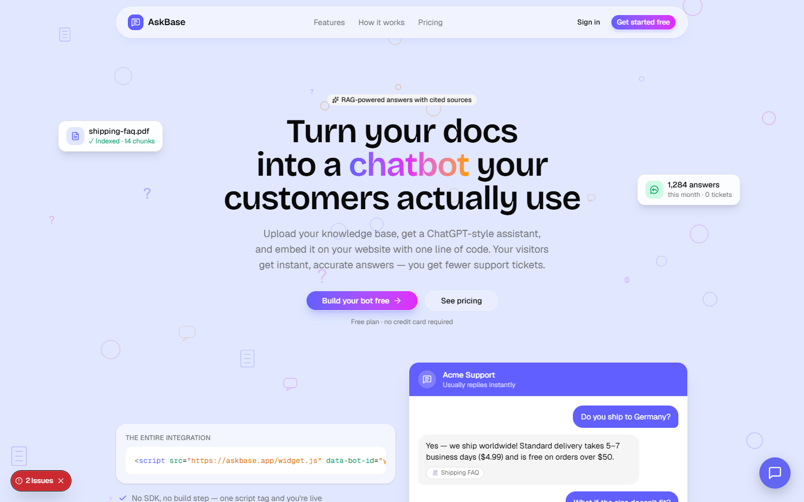
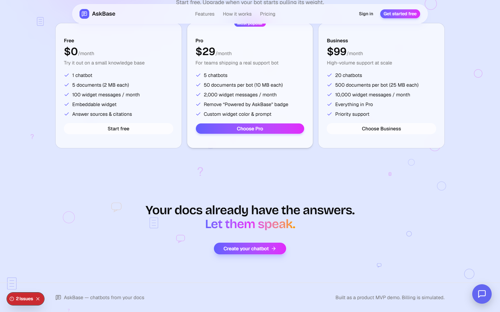
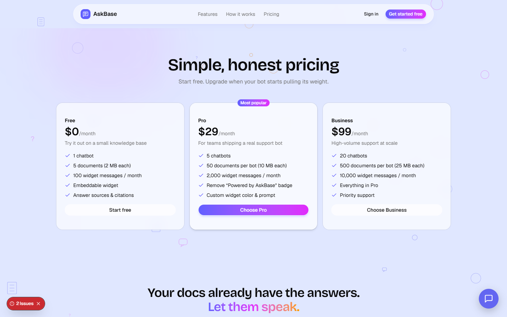
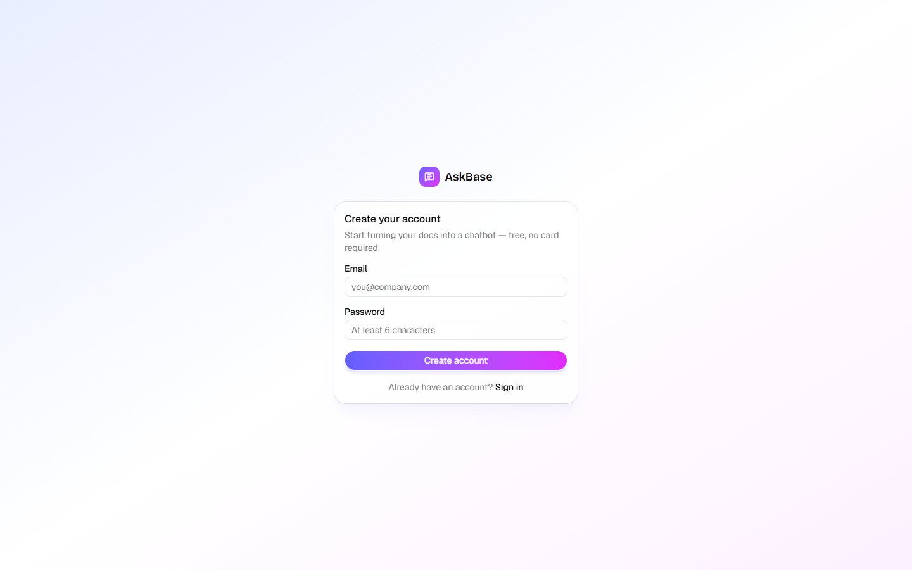
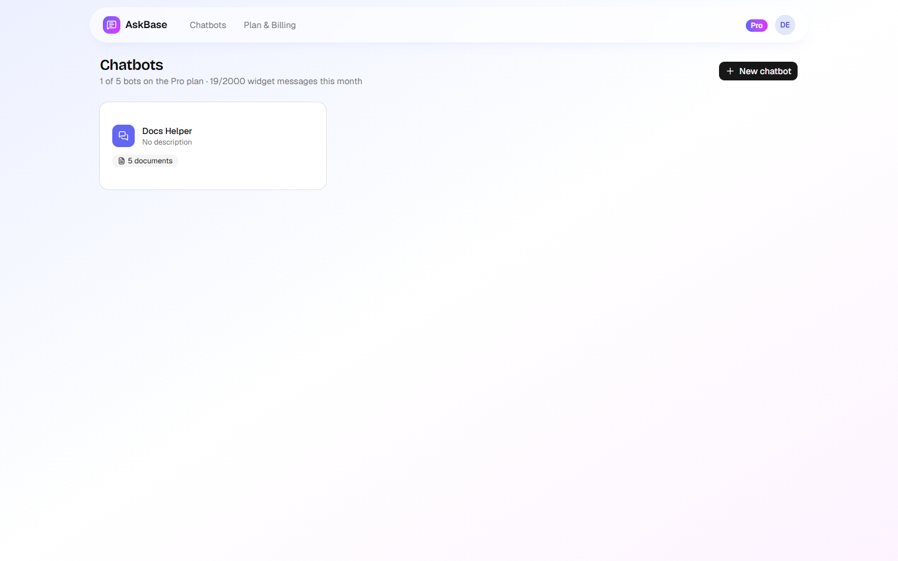
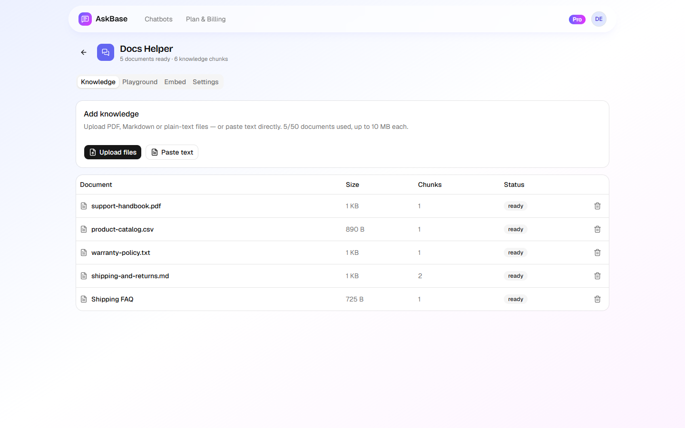
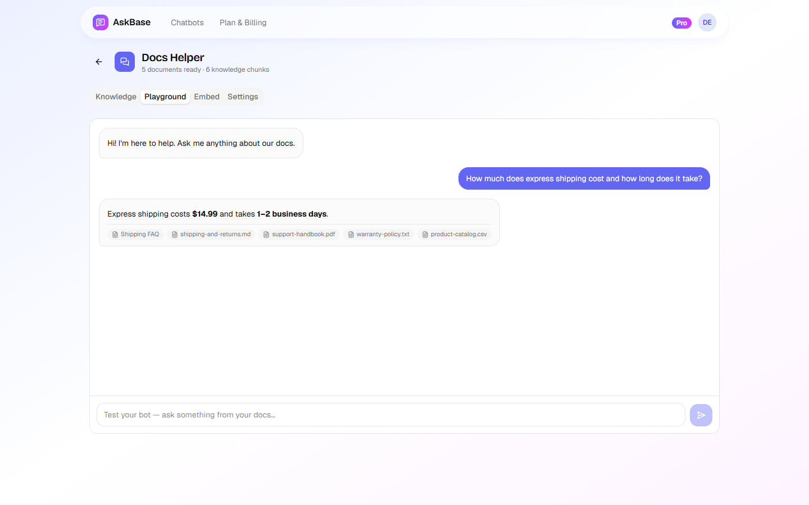
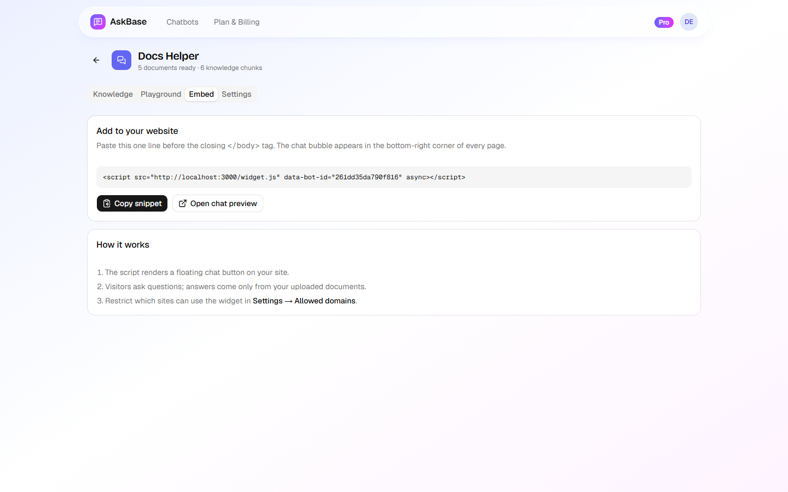
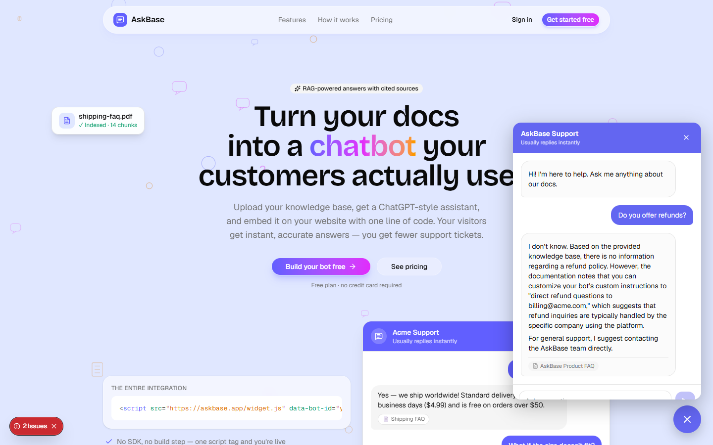
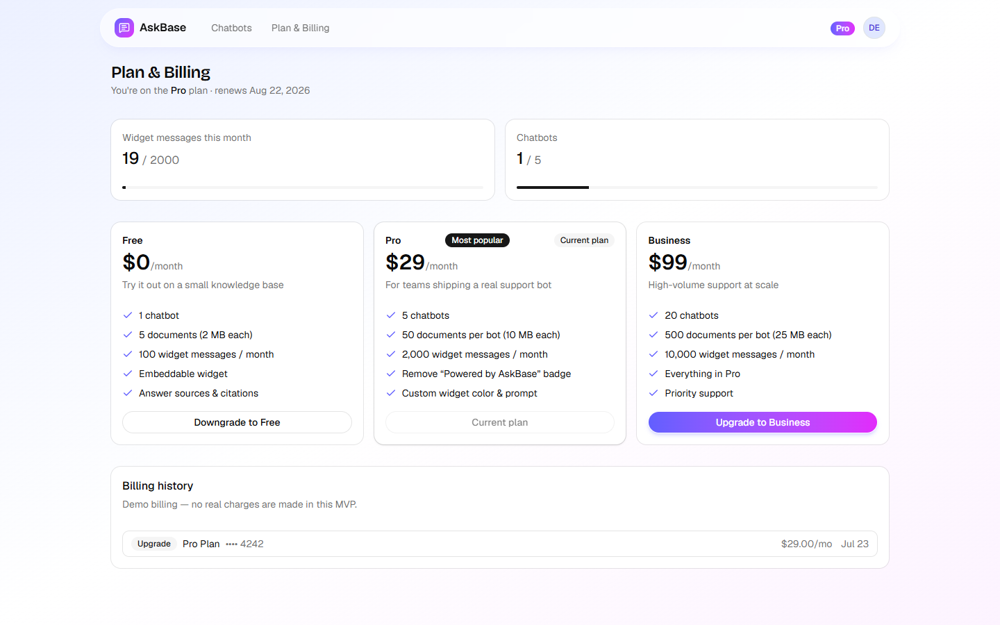

# AskBase — презентация продукта (письменный туториал со скриншотами)

Сквозной проход по продукту: от лендинга до работающего виджета и биллинга.
Все скриншоты сняты автоматически скриптом
[`scripts/capture-screens.mjs`](../scripts/capture-screens.mjs) с живого
приложения, подключённого к OpenAI-совместимой локальной LLM (режим `ai`).

> Воспроизвести: `node scripts/capture-screens.mjs <email> <password>` —
> скрипт сам логинится, загружает файлы, задаёт вопросы и снимает кадры.

---

## 1. Лендинг

Интерактивный фон: цвет страницы плавно меняется по мере прокрутки, вверх
всплывают контурные «пузырьки знаний» (чат, документы, вопросы), свечение
следует за курсором. В hero — самопроигрывающийся демо-чат, справа внизу —
**настоящий** встраиваемый виджет.



Секция «How it works» прилипает к экрану: прокрутка листает шаги 01 → 03
с анимированными сценками и сменой фонового оттенка.



Тарифы: Free / Pro $29 / Business $99, лимиты честно совпадают с тем, что
enforced в базе данных.



## 2. Регистрация

Email + пароль, без подтверждения почты (MVP). После входа — сразу дашборд.



## 3. Дашборд и создание бота

Список ботов, счётчик использования плана, создание бота в один шаг.



## 4. База знаний — мультизагрузка файлов

Кнопка **Upload files** принимает несколько файлов сразу (PDF, MD, TXT, CSV,
JSON, HTML). Каждый файл парсится, режется на чанки и эмбеддится Supabase
Edge-функцией (gte-small, pgvector). На кадре — 5 документов из
[`samples/`](../samples), загруженные одной пачкой.



## 5. Playground — проверка ответов

Вопрос: *«How much does express shipping cost and how long does it take?»*
Ответ локальной модели точен по документам — **$14.99, 1–2 business days** —
и подкреплён чипами источников.



## 6. Встраивание — одна строка кода

Сниппет копируется из вкладки Embed и вставляется перед `</body>` любого
сайта.



Виджет вживую на лендинге (это тот же скрипт, «съедающий собственный корм»):



## 7. Биллинг и квоты

Счётчик сообщений виджета растёт с каждым вопросом посетителя (Playground
квоту не тратит). Лимиты enforced в Postgres. Кнопки честно показывают
Upgrade/Downgrade относительно текущего плана. Checkout симулируется картой
`4242 4242 4242 4242` — реальных платежей в MVP нет.



## 8. Автотесты чата

Смоук-тест гоняет вопросы через публичный API виджета и сверяет ответы
с ожиданиями (цены из документов, отказ отвечать вне базы, удержание
контекста диалога):

```text
$ node scripts/chat-smoke.mjs 261dd35da790f816

PASS  [ai] How much does express shipping cost and how long does it take?
PASS  [ai] Can I return an item after 45 days?
PASS  [ai] Do you accept cash on delivery?
PASS  [ai] What is the capital of France?        ← бот отказывается галлюцинировать
PASS  [ai] follow-up keeps context (expects 1–2 business days)

All checks passed ✅
```

Полный чек-лист ручной приёмки — в [TESTING.md](../TESTING.md).
